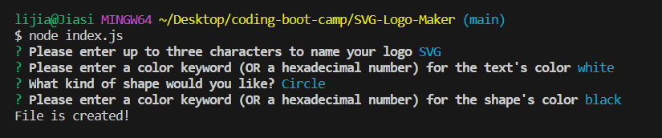
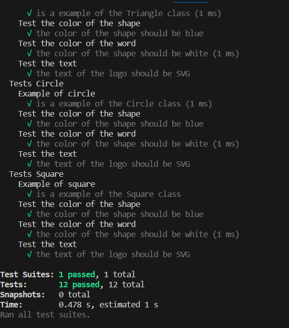

# 10 Object-oriented Programming: SVG Logo Maker

## Description

My task this week is to build a Node.js command-line application that takes in user input to generate a logo and save it as an [SVG file]. The application prompts the user to select a color and shape, provide text for the logo, and save the generated SVG to a `.svg` file.

## Screenshots

## Review

* A walkthrough video:

* The URL of the GitHub repository:
https://github.com/Jiasisi/SVG-Logo-Maker

